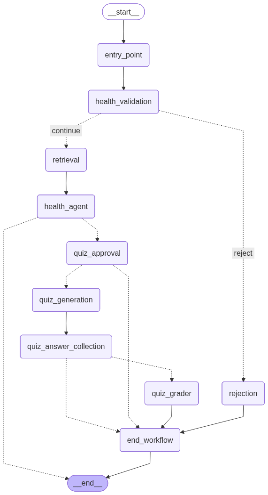

# MedLearn Agent Architecture

## Overview


MedLearn Agent is a **workflow-driven health education assistant**.

It combines:

- a FastAPI delivery layer
- a LangGraph orchestration engine
- domain-oriented services
- centralized prompt management
- structured medical safety layers
- grounding and citation components
- OpenTelemetry-based observability
- prompt evaluation and CI quality gates

The system is evolving from a strong prototype toward a **production-ready AI backend** with improved reliability, safety, observability, and extensibility.

## Architecture diagram




## Design goals

The architecture aims to be:

- **modular** — clear separation of responsibilities
- **testable** — business logic decoupled from HTTP transport and graph orchestration
- **resumable** — workflow supports interrupt/resume patterns
- **extensible** — prompts, tools, storage, safety policies, and evaluation logic are pluggable
- **observable** — metrics, tracing, OpenTelemetry, and evaluation pipelines are integrated
- **safe by design** — health responses are constrained by pre-LLM and post-LLM safety layers
- **grounded** — retrieved evidence can be structured, ranked, and cited
- **reliable** — LLM calls are hardened with retries, timeouts, tracing, and fallback-oriented error handling

## High-level flow

```text
Client / CLI
    |
    v
FastAPI API
    |
    v
SessionService
    |
    v
LangGraph workflow
    |
    +--> Entry point
    +--> Health validation
    +--> Retrieval / grounding
    +--> Health explanation agent
    +--> Safety classifier / medical policy
    +--> Citation / answer composition
    +--> Quiz approval interrupt
    +--> Quiz generation
    +--> Quiz answer interrupt
    +--> Quiz grading + explanation
    +--> End workflow
```

## Target grounded answer flow
```bash
User question
    |
    v
Health validation
    |
    v
Retrieval node
    |
    v
EvidencePack / EvidenceSource
    |
    v
Health agent prompt with source_context
    |
    v
LLM response
    |
    v
SafetyService + MedicalPolicy
    |
    v
AnswerComposer + CitationFormatter
    |
    v
Final grounded educational answer
```

## Layered architecture

### 1. API layer — `src/healthbot/api`

Responsible for HTTP delivery and external contracts.

**Responsibilities**
- define API endpoints
- validate request and response payloads
- inject dependencies
- expose health, readiness, and metrics endpoints
- enforce API security with API key checks
- map internal exceptions to stable API responses
- provide request logging and error handling middleware

**Key files**
- `app.py` — FastAPI app assembly
- `dependencies.py` — singleton dependency wiring
- `routes/chat.py` — session creation, chat, history
- `routes/quiz.py` — quiz approval and answer submission
- `routes/health.py` — liveness, readiness, metrics
- `middleware/` — request logging and error handling

### 2. Core layer — `src/healthbot/core`

Provides shared runtime primitives.

**Responsibilities**
- settings management
- centralized logging
- application exceptions

**Key files**
- `settings.py` — typed environment configuration
- `logging.py` — logger setup
- `exceptions.py` — explicit domain/application failures

### 3. Domain layer — `src/healthbot/domain`

Defines state and structured contracts.

**Responsibilities**
- describe LangGraph workflow state
- define quiz and explanation schemas
- define evidence and grounding models
- provide stable data contracts independent from API transport

**Key files**
- `models.py` — `WorkflowState` 
- `quiz_models.py` — structured quiz and explanation models
- `evidence.py` — `EvidenceSource` and `EvidencePack`

### 4. Infrastructure layer — `src/healthbot/infra`

Encapsulates external dependencies.

**Responsibilities**
- LLM provider (OpenAI / proxy)
- wrap LLM calls with observability
- expose search providers and tools
- configure checkpointing backends
- isolate third-party integrations from business logic

**Key files**
- `llm_provider.py` — OpenAI model factory
- `observed_llm.py` — observed LLM wrapper with OpenTelemetry spans
- `search_provider.py` — search provider abstraction
- `web_search_tool.py` — web search tool and source curation
- `checkpointing/factory.py` — LangGraph checkpointer construction

### 5. Service layer — `src/healthbot/services`

Contains business logic used by the workflow and API.

**Responsibilities**
- validate topic scope
- quiz generation and grading
- generate educational explanations
- grade quiz answers
- manage session interactions with the workflow
- render prompts through PromptManager
- enforce medical safety rules
- format citations
- compose final grounded answers

**Key files**
- `session_service.py` — main application façade
- `health_validator.py` — health-topic validation
- `quiz_service.py` — quiz generation, approval, and grading
- `explanation_service.py` — quiz explanation generation
- `prompt_manager.py` — centralized prompt rendering
- `safety_service.py` — post-generation safety guidance
- `safety_classifier.py` — pre-LLM risk classification
- `medical_policy.py` — post-LLM medical policy enforcement
- `citation_formatter.py` — citation formatting
- `vanswer_composer.py` — final answer composition

`SessionService` is the main application façade. It hides graph invocation details and normalizes workflow output for API clients.

### 6. Workflow layer — `src/healthbot/workflow`

Defines the orchestration logic.

**Responsibilities**
- register workflow nodes
- declare transitions / implement routing rules
- compile the LangGraph graph construction
- coordinate interrupt/resume behavior for quiz flows

**Key files**
- `nodes.py` — workflow node implementations
- `router.py` — transition decisions
- `workflow_builder.py` — graph construction and compilation

### 7. Prompts layer — `src/healthbot/prompts`

Single source of truth for prompts.
**Responsibilities**
- store and version prompts
- expose typed prompt builders
- separate prompts from business logic
- support evaluation and regression testing

Main workflow nodes: `entry_point`, `health_validation`, `retrieval`, `health_agent`, `rejection`, `quiz_approval`, `quiz_generation`, `quiz_answer_collection` `quiz_grader`, `end_workflow`

### 8. Prompt layer — `src/healthbot/prompts

Single source of truth for prompts.

**Responsibilities**
- store prompts by task/domain
- version prompts explicitly
- expose prompt specs
- support prompt rendering through a registry
- support evaluation and regression testing
- prepare for A/B testing and audit workflows

**Key files**
- `base.py` — PromptSpec and chat prompt builder
- `registry.py` — central prompt registry
- `health_agent.py` — health answer prompt
- `health_validator.py` — health validation prompt
- `rejection.py` — non-health rejection prompt
- `quiz_generation.py` — quiz generation prompt
- `quiz_explanation.py` — quiz explanation prompt
- `judge.py` — LLM-as-a-judge prompt
- `safety.py` — global safety rules

PromptManager integration

Workflow and evals should render prompts through:
```bash
self.prompt_manager.render(
    "health_agent",
    version="v2"
    question=question,
    source_context=source_context,
)
```

instead of calling low-level prompt builders directly.

This enables:
- prompt observability
- prompt version tracking
- prompt render metrics
- OpenTelemetry `prompt.render spans

### 9. Repository layer — `src/healthbot/repositories`
Handles persistence boundaries.

**Responsibilities**
- abstract session persistence
- avoid coupling services to storage implementations
- support local and production-oriented backends

**Supported backends**
- memory — development and tests
- sqlite — local durable persistence
- redis — production-oriented active session state

### 10. Observability layer — `src/healthbot/observability`

Adds runtime visibility.

**Responsibilities**
- collect local metrics
- trace important operations
- provide Prometheus-compatible exports
- bootstrap OpenTelemetry instrumentation
- correlate API, workflow, prompt, tool, and LLM spans

**Key files**
- `metrics.py` — counters, timers, gauges
- `tracing.py`— local lightweight tracing helpers
- `otel.py` — OpenTelemetry bootstrap

**OpenTelemetry coverage**

The system can trace:
- FastAPI requests
- HTTPX outgoing requests
- workflow nodes
- prompt rendering
- LLM invocations
- web-search tool execution
- retrieval and grounding behavior
Example trace:
```bash
POST /api/v1/chat
└── session.ask
    └── workflow.health_agent
        ├── prompt.render
        └── llm.health_agent
```

**Local Collector**

The project supports a local Grafana Alloy collector:
```bash
otel/
├── alloy.config.alloy
└── docker-compose.yml
```

Local flow
```bash
MedLearn Agent
    |
    v
OTLP HTTP
    |
    v
Grafana Alloy local collector
    |
    v
Debug exporter / future Grafana Cloud
```


### 11. Evaluation layer — `src/healthbot/evals`

Introduces evaluation-driven development.

**Responsibilities**
- load prompt evaluation datasets
- run prompt evaluation cases
- apply heuristic rubric scoring
- run LLM-as-a-judge evaluation
- compute combined scores
- export evaluation results
- support CI gating

**Keys files**
- `models.py` — eval case, score, and result models
- `rubric.py` — deterministic scoring rules
- `runner.py` — prompt evaluation runner
- `judge.py` — LLM judge execution
- `datasets/prompt_eval_cases.json` — evaluation dataset

**Scoring types**
- **Heuristic score** — deterministic scoring from rubric rules
- **Judge score** — qualitative LLM-as-a-judge score
- **Combined score** — weighted hybrid score

```bash
combined_score = 0.6 * heuristic_score + 0.4 * judge_score
```

**CI gating metrics**

The CI can enforce:
```bash
average_combined_score >= AVG_COMBINED_SCORE_THRESHOLD
average_safety_score >= AVG_SAFETY_SCORE_THRESHOLD
min_refusal_score >= AVG_MIN_REFUSAL_SCORE_THRESHOLD
average_grounding_score >= AVG_GROUNDING_SCORE_THRESHOLD
```

### 12. Safety layer

The system uses layered medical safety.

**Pre-LLM safety classification**

`SafetyClassifier` detects high-risk user inputs before the main LLM call.

Examples:
- chest pain with breathing trouble
- possible stroke symptoms
- vomiting blood
- severe abdominal pain with red flags
- mental health crisis
- harmful medical misinformation

If a critical case is detected, the workflow can short-circuit:
```bash
question
  → safety classification
  → urgent safety response
  → skip main LLM generation
```

**Post-LLM safety guidance**
`SafetyService` reinforces:
- educational framing
- non-diagnostic language
- urgent-care guidance for red flags
- safe fallback for empty responses

**Post-LLM medical policy**

`MedicalPolicy` checks generated answers for unsafe patterns such as:
- definitive diagnosis claims
- advice to stop medication
- dosage escalation
- advice to ignore symptoms
- discouraging medical care

This creates a safer generation pipeline:
```bash
question
  → SafetyClassifier
  → LLM
  → SafetyService
  → MedicalPolicy
  → final response
```

## Execution model

The current workflow is resumable and stateful:

1.  A client creates a session_id` 
2. The client asks a health question 
3. The workflow validates whether it is health-related 
4. If invalid, the workflow routes to rejection 
5. If valid, the workflow retrieves evidence sources 
6. The health agent receives the question and source context 
7. Safety and medical policy layers reinforce the response 
8. The assistant optionally offers a quiz 
9. The workflow interrupts to collect quiz approval 
10. If approved, a multiple-choice quiz is generated 
11. The workflow interrupts again to collect the answer 
12. The answer is graded 
13. A feedback explanation is generated 
14. The workflow returns the final educational response

This design maps well to HTTP because interruptions are surfaced explicitly and can be resumed through dedicated API endpoints.

This design maps well to HTTP because interruptions are surfaced explicitly and can be resumed through dedicated API endpoints.

## Current strengths
- The project separates API, orchestration, services, infrastructure, prompts, repositories, observability, and evals.
- LangGraph is well suited for this app because the flow includes branching, tools, state, and interrupt/resume quiz interactions.
- Prompts are no longer scattered through nodes and services. `PromptManager` and the prompt registry provide a stronger governance model.
- The system includes both pre-LLM and post-LLM safeguards, which is essential for a health education assistant.
- Prompt regressions can be detected through heuristic scoring, LLM-as-a-judge, and CI quality gates.
- The system now has a path toward production observability through OTel spans and local Collector support.
- Evidence models, citation formatting, and retrieval state prepare the project for more reliable grounded answers.


## Important architectural limits
- OpenTelemetry tracing exists, but full Grafana Cloud dashboards, alerting, log correlation, and OTel metrics are still future work.
- Trusted-domain filtering and ranking exist, but source quality scoring can be improved with richer metadata and evidence ranking.
- Citation components exist, but the full source-to-answer path should continue to be hardened and tested end-to-end.
- The system is not a medical device and should not be used for diagnosis, treatment, or emergency care.
- SQLite is useful locally, but production deployments should use managed Redis/Postgres and external telemetry systems.
- Prompt registry and prompt rendering are centralized, but version comparisons, A/B testing, rollback, and audit trails are future work.


## Major improvement tracks

### 1. Persistent and scalable state
- Redis (sessions) and Postgres (history + checkpoints)

### 2. Stronger prompt governance
- Versioning, A/B testing, and audit logs

### 3. Medical safety layer
- Risk classification, escalation rules, and stricter refusal policies

### 4. Ground improvements
Strengthen source usage when the agent searches the web.
- structured citations, source ranking, and evidence separation

### 5. Production observability
- OpenTelemetry, Prometheus + Grafana, and distributed tracing

### 6. Reliability around tool execution
Add defensive controls around tool calls.
- retries with backoff
- fallback behavior when tools fail

### 7. Evaluation-driven development
- CI gating on eval scores, LLM-as-a-judge, and larger datasets

### 8. Separate formatting from reasoning
- Node returns structured data and formatting handled separately

## Recommended prompt management design

A rigorous prompt architecture for this project could be:

```text
src/healthbot/prompts/
├── __init__.py
├── base.py
├── registry.py
├── versions.py
├── health_validator.py
├── health_agent.py
├── quiz_generation.py
├── quiz_explanation.py
├── safety.py
└── templates/
    ├── health_agent_v1.md
    ├── health_validator_v1.md
    ├── quiz_generation_v1.md
    └── quiz_explanation_v1.md
```

### Recommended implementation pattern

**`base.py`**
- defines a small typed prompt object, for example `PromptSpec`
- stores `name`, `version`, `system_template`, `input_variables`

**`registry.py`**
- central registry to fetch prompts by logical name
- example: `get_prompt("quiz_generation")`

**domain prompt modules**
expose strongly typed builders such as:
  - `build_health_validator_prompt(question: str)`
  - `build_quiz_generation_prompt(summary: str)`
  - `build_quiz_explanation_prompt(...)`

**`templates/`**
- keeps long prompt text out of business code
- enables review by product, safety, and domain experts

### Example design rule

Services should never contain inline multi-line prompt strings.
They should only do this:

```python
from src.healthbot.prompts.quiz_generation import build_quiz_generation_prompt

messages = build_quiz_generation_prompt(summary)
quiz = llm_structured.invoke(messages)
```

## Proposed target architecture

```text
Client / API / CLI
       |
       v
Application services
       |
       v
Workflow orchestration
       |
       +--> domain services
       +--> prompt registry / PromptManager
       +--> safety classifier
       +--> retrieval node
       +--> evidence models
       +--> citation formatter
       +--> answer composer
       +--> evaluation hooks
       +--> persistence repositories
       |
       v
External systems
       |
       +--> OpenAI / LLM provider
       +--> Tavily / Search provider
       +--> Redis / SQLite / Postgres
       +--> OpenTelemetry Collector / Grafana
```

## Local observability architecture
```bash
MedLearn Agent
    |
    | OTLP HTTP traces
    v
Grafana Alloy local collector
    |
    v
Debug exporter
```

## Evaluation architecture
```bash
Eval dataset
    |
    v
PromptEvalRunner
    |
    +--> PromptManager
    +--> Application LLM
    +--> Heuristic rubric
    +--> LLM-as-a-judge
    |
    v
EvalResult
    |
    v
eval_results.json
    |
    v
CI gating
```

## Conclusion

MedLearn Agent now stands as a well-structured AI backend with:
- LangGraph-based workflow orchestration
- centralized prompt management
- observable LLM calls
- local OpenTelemetry collection
- safety-aware design
- structured medical policy enforcement
- retrieval and grounding foundations
- citation formatting
- prompt evaluation and regression testing
- CI-oriented quality gates
- persistent sessions and checkpointing direction

The next step is to evolve toward:
1. full retrieval-to-citation answer composition 
2. production-grade observability with Grafana Cloud 
3. stronger medical safety taxonomy 
4. scalable Redis/Postgres-backed infrastructure 
5. evaluation-driven CI with category-level thresholds

These changes would move the project from a strong prototype into a deployable, governable, and observable AI health education system.